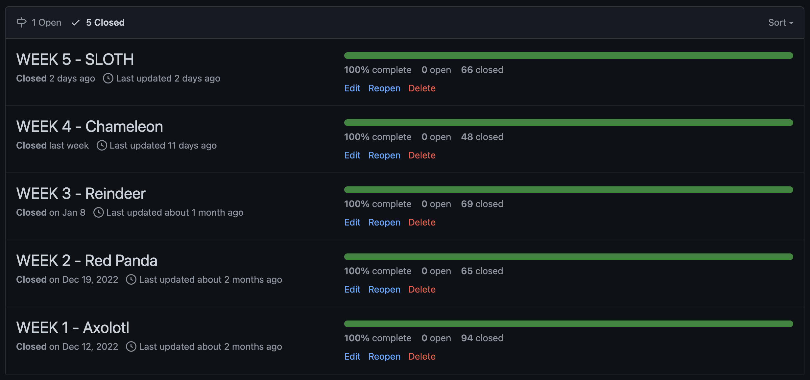
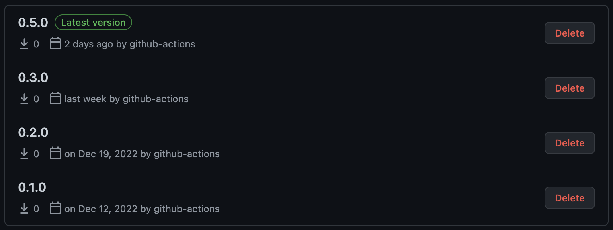
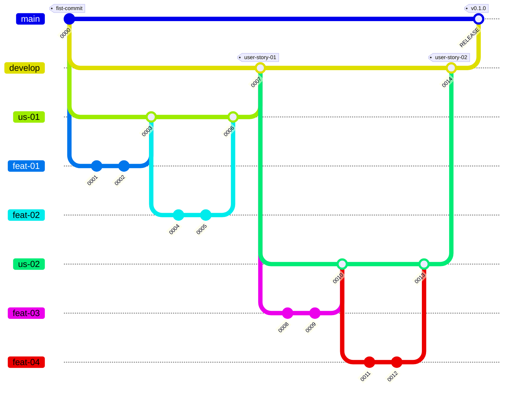

# Takenoko 🎋 Knowledge Report

**WRITE IN ENGLISH MOTHERDUCKER 🦆 !!!**

• un résumé des fonctionnalités réalisées sur tout le jeu (couverture des règles du jeu indépendamment de ce qui était demandé cette semaine), et éventuellement la liste de ce qui n'a pas été fait.

• un résumé de ce qui a été fait pour les logs (en quelques lignes max, quels choix ont été faits pour les réaliser)

• un résumé de ce qui a été fait pour les statistiques en CSV (en quelques lignes max, quels choix ont été faits pour les réaliser)

• un résumé de ce qui a été fait pour le bot spécifique demandé, et éventuellement une comparaison avec votre meilleur bot et une analyse de pourquoi celui qui gagne est le meilleur

## Summary
1. [Progress Report](#Progress-Report)
    1. test
    2. test2
2. [Architecture and Quality](#Architecture-and-Quality)
    1. test
3. [Process](#Process)
    1. [Git Branching Strategy](#Git-Branching-Strategy)

---

## Progress Report

---

## Architecture and Quality

---

## Process

### Roles and Involvement

- Qui est responsable de quoi / qui a fait quoi ?

### Task Management

#### Agile Principles

We tried to follow the Agile principles for our task management throughout the whole project.
To do so, we decided to work with *Releases*, *User Stories* and *Features*.

*Releases* are meant to be **regular** and **must be stable**. They also must add value to the project. We did weekly releases that were each containing about 3 *User stories*.

The *User Stories* are used to specify needs from the clients or developers.
We tried to follow this naming convention for most of our them :
- "As a dev, I can ... in order to ..."
- "As a bot, I can ... in order to ..."

However, some have different names...

Concerning the *Features*, they are contained inside a *User Story*. Many *features* can be inside a single user story, but a *feature* only belongs to one *user story*.
The *Features* are used to define a specific need to add to the project.

#### Github

##### Releases

We only used Github for our task management as we could do everything we wanted there.

The *Releases* were specified using *Milestones* from GitHub. As we were aiming to do one release per week, we also had one milestone per week.
However, we fell behind some deadlines, especially during the Christmas holidays. This means that we have less releases than weeks of work. However, they still follow this naming convention : "WEEK 00 - [ANIMAL NAME]". The week number was increased by one each time we did a release.

Each time we did a release, we also created a package that could then be installed using Maven.
One version number is missing, because during the holiday we should have created package 0.3.0. But we did not, so later we released 0.4.0 as 0.3.0. And then we decided to bump the version up to get back to the correct one.

##### Tags

We used tags on all the issues to specify if it was a *User Story* or a *Feature*. The issues could also have different tags like "docs", "test", "fix" or "hotfix".

##### GitHub Project

All of our issues where assigned to a Github Project. Since they were also correctly tagged, and we were opening and closing them when needed, we had some statistics and graphs to look at.
We also tried to use the kanban provided but found out that, since issues were added gradually, we could just follow their status in the list of issues.

You can find two of the interesting graphs below.

### Git Branching Strategy

Our strategy does not correspond to any other one that we could find online.
However, it is inspired by the [Git Flow Strategy](https://www.atlassian.com/git/tutorials/comparing-workflows/gitflow-workflow). We modified it in order to have branches corresponding to how our tasks were organized.
Those tasks were organized in order to correspond to our we are [managing our tasks](#Task-Management). This implies that we have the following branch categories :
- `main` : contains the stable releases
- `develop` : contains the stable user stories
- `us-` : contains a user story currently being developed
- `feat-` : contains a feature currently being developed

You can find below a visual representation of our branching strategy.

### Continuous Development and Automation

#### Github Hooks

#### Format check

#### Maven compiler

#### Continuous integration with SonarQube

##### Jacoco

##### PIT test

#### Package
