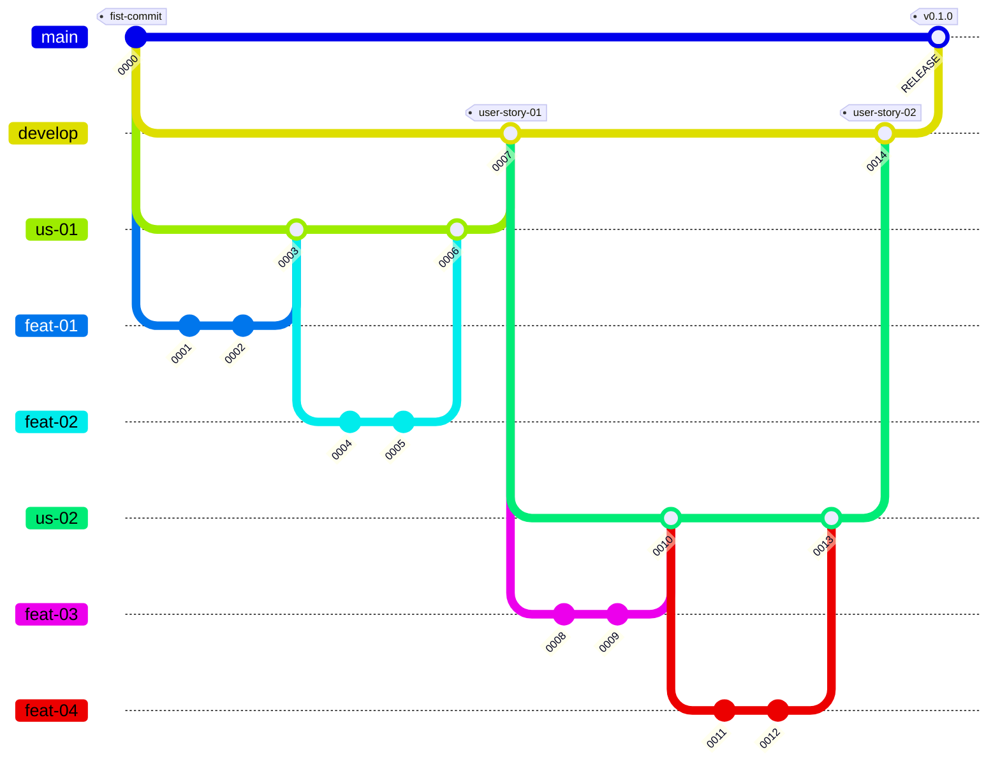

# Takenoko 🎋 Knowledge Report

## Summary
1. [Progress Report](#Progress-Report)
   1. test
   2. test2
2. [Architecture and Quality](#Architecture-and-Quality)
   1. [Architecture](#architecture)
      1. [GameEngine](#game-engine)
      2. [Action](#action)
      3. [Objective](#objective)
      4. [Bot](#bot)
      5. [BotManager](#bot-manager)
      6. [Board](#board)
      7. [Layers](#layers)
      8. [Shape](#shape)
      9. [Statistics](#statistics)
      10. [Logging](#logging)
      11. [Coordinate](#coordinate)
   2. [Quality](#quality)
   3. [Documentation](#documentation)
3. [Process](#Process)
   1. [Task Management](#Task-Management)
      1. [Agile Principles](#Agile-Principles)
      2. [Github](#Github)
         1. [Releases](#Releases)
         2. [Tag](#tags)
         3. [GitHub Project](#GitHub-Project)
   2. [Git Branching Strategy](#Git-Branching-Strategy)
   3. [Continuous Development and Automation](#Continuous-Development-and-Automation)
      1. [Format check](#Format-check)
      2. [Maven compiler](#Maven-compiler)
      3. [Continuous integration with SonarQube](#Continous-integration-with-SonarQube)
         1. [Jacoco](#Jacoco)
         2. [PIT test](#PIT-test)
         3. [Package](#Package)
 
## Progress Report

---

## Architecture and Quality

### Overview

In this section, we will go over all the main components of our architecture. We will discuss how it works, how it used
and if its quality is good.
Here is the list of all the components : 
- [GameEngine](#game-engine) -> responsible for managing the course of the game
- [Action](#action) -> something that the bot can do
- [Objective](#objective) -> represent an objective card
- [Bot](#bot) -> only contains the behavior
- [BotManager](#bot-manager) -> stores a bot with its inventory and attributes
- [Board](#board) -> contains all the elements that can be placed or used on the board
- [Layers](#layers) -> different types of layers to represent the tiles, the bamboos and the irrigation channels
- [Shape](#shape) -> represents a combination of tiles
- [Statistics](#statistics) -> used to measure and export what is happening during a game
- [Logging](#logging) -> used to display data in the console with different levels
- [Coordinate](#coordinate) -> represent the cube coordinates for a hexagonal grid

Even if we discuss the quality of each component, we will spend some time discussing the SonarQube report, the test coverage and
what we think of the quality of the project in general. It is in this section : [Quality](#quality)

Regarding documentation, you can find our [Javadoc](https://pns-si3-projects.github.io/projet2-ps5-22-23-takenoko-2023-c/apidocs/index.html) 
as well as our [PIT test report](https://pns-si3-projects.github.io/projet2-ps5-22-23-takenoko-2023-c/pit-reports/index.html) hosted via GitHub Pages.
We also have the whole [Maven documentation](https://pns-si3-projects.github.io/projet2-ps5-22-23-takenoko-2023-c/project-info.html) generated.
The subject is discussed in the following section : [Documentation](#documentation)

### Architecture

For each category, we will focus how the system works in general. This means that we won't go in details about each attribute
or method a class has. However, you should be able to understand how the project is tied up.

#### Game Engine

Our game engine follows a really simple procedure and has quite few responsibility.  
To run a game you just need to call the four following methods in order : 
- `newGame()`
- `startGame()`
- `playGame()`
- `endGame()`

This execution process is already defined in the `runGame()` method. If you do not run the previous methods in order, it will
raise an error explaining why it failed.

You can also run many games one after the other using the following method : `runGame(int)`.

You can specify the bot managers you want to use in your game by using one of the constructors.

   

#### Action

#### Objective

The `Objective` class represents an objective card from the game.
It can have one of the three available types. It also has a state to specify if it is achieved or not.

All of our objectives extend the `Objective` class.

Each objective has a different `verify(...)` method that can be called to know if the objective is achieved or not on the 
current setup of the board. 
Each objective has a different `getCompletion(...)` in order to find out the highest percentage of completion for the said
objective.

   

#### Bot

#### Bot Manager

As said in the name, the `Bot Manager` is responsible for managing a bot, its available actions, its inventory, its objectives.
A `Bot` in itself just represent the behavior of the said bot (see [Bot](#bot)).

The main method of a bot manager is `playBot(...)`. This method is responsible for managing correctly how a bot turn should go.  
This means that it will roll the weather dice and then tell the bot to choose to do.  
Then, in the limit of doable actions, the bot manager will just call the `chooseAction(...)` of the bot. The result given
can then be executed and added to the history.  
The result of the execution is an `ActionResult` which can then be used to update the available actions of the bot. To lear
more about the `ActionResult` see [Action](#action).

   

#### Board

The `Board` contains all the physical elements of a real game.  
The `Panda` and `Gardener` each have their own class that extends `Actor`. This class is responsible for managing the 
movements.
The physical board is built from the tiles, the bamboos and the irrigation channels. To represent those we used layers, so
our board has an attribute for each type of layer. To learn more see [Layers](#layers).
Since the weather is also general to the whole game, it belongs in `Board`.
Finally, we have a class `GameAssets` whose job is to store the weather dice, the improvement deck, the objective deck,
the tile deck and the irrigation deck. All of those are their own class.

Because the board contains so many elements, and that each of them is its own class, our `Board` is in fact only a facade. 
Having a facade is useful to avoid the anti-pattern named "Train Wreck Pattern". 
Having a facade is also useful because the method called is independent of the method implemented below.

   

#### Layers

#### Shape

#### Statistics

#### Logging

#### Coordinate

### Quality

#### Good quality

#### Not so good quality

### Documentation

As said in the [Overview](#overview), you can our [Javadoc](https://pns-si3-projects.github.io/projet2-ps5-22-23-takenoko-2023-c/apidocs/index.html)
as well as our [PIT test report](https://pns-si3-projects.github.io/projet2-ps5-22-23-takenoko-2023-c/pit-reports/index.html) hosted via GitHub Pages.
We also have the whole [Maven documentation](https://pns-si3-projects.github.io/projet2-ps5-22-23-takenoko-2023-c/project-info.html) generated.

The Javadoc could be more complete and the code is lacking quite some comments in certain areas of the code. We tried our
best to comment what we were doing as it is as important as the file you are currently reading.

The PIT test report results are discussed in the [Quality](#quality) section.

---

## Process

### Roles and Involvement

   

   

### Task Management

#### Agile Principles

We tried to follow the Agile principles for our task management throughout the whole project.
To do so, we decided to work with *Releases*, *User Stories* and *Features*.

*Releases* are meant to be **regular** and **must be stable**. They also must add value to the project. We did weekly releases that were each containing about 3 *User stories*.

   

The *User Stories* are used to specify needs from the clients or developers.
We tried to follow this naming convention for most of our them :
- "As a dev, I can ... in order to ..."
- "As a bot, I can ... in order to ..."

   

However, some have different names...

Concerning the *Features*, they are contained inside a *User Story*. Many *features* can be inside a single user story, but a *feature* only belongs to one *user story*.
The *Features* are used to define a specific need to add to the project.

   

#### GitHub

##### Releases

We only used GitHub for our task management as we could do everything we wanted there.

The *Releases* were specified using *Milestones* from GitHub. As we were aiming to do one release per week, we also had one milestone per week.
However, we fell behind some deadlines, especially during the Christmas holidays. This means that we have less releases than weeks of work. However, they still follow this naming convention : "WEEK 00 - [ANIMAL NAME]". The week number was increased by one each time we did a release.

   

Each time we did a release, we also created a package that could then be installed using Maven.
One version number is missing, because during the holiday we should have created package 0.3.0. But we did not, so later we released 0.4.0 as 0.3.0. And then we decided to bump the version up to get back to the correct one.

   

   

##### Tags

We used tags on all the issues to specify if it was a *User Story* or a *Feature*. The issues could also have different tags like "docs", "test", "fix" or "hotfix".

##### GitHub Project

All of our issues where assigned to a GitHub Project. Since they were also correctly tagged, and we were opening and closing them when needed, we had some statistics and graphs to look at.
We also tried to use the kanban provided but found out that, since issues were added gradually, we could just follow their status in the list of issues.

You can find two of the interesting graphs below.

   

   

### Git Branching Strategy

Our strategy does not correspond to any other one that we could find online.
However, it is inspired by the [Git Flow Strategy](https://www.atlassian.com/git/tutorials/comparing-workflows/gitflow-workflow). We modified it in order to have branches corresponding to how our tasks were organized.
Those tasks were organized in order to correspond to our we are [managing our tasks](#Task-Management). This implies that we have the following branch categories :
- `main` : contains the stable releases
- `develop` : contains the stable user stories
- `us-` : contains a user story currently being developed
- `feat-` : contains a feature currently being developed

You can find below a visual representation of our branching strategy.

### Continuous Development and Automation

#### GitHub Hooks

#### Format check

#### Maven compiler

#### Continuous integration with SonarQube

##### Jacoco

##### PIT test

#### Package
