# Takenoko 🎋 Knowledge Report

## Summary

1. [Progress Report](#progress-report)
    1. [Game Functionalities](#game-functionalities)
    2. [Logs Implemented](#logs-implemented)
    3. [Statistics Implemented](#statistics-implemented)
    4. [Bots implemented](#bots-implemented)
        1. [Bot specified in the specs](#bot-specified-in-the-specs)
        2. [Our best bot : General Tactics](#our-best-bot--general-tactics)
        3. [Which one is the best ?](#which-one-is-the-best-)
2. [Architecture and Quality](#architecture-and-quality)
    1. [Architecture](#architecture)
        1. [GameEngine](#game-engine)
        2. [Action](#action) <- TODO (schema)
        3. [Objective](#objective)
        4. [Bot](#bot) <- TODO (schema done)
        5. [BotManager](#bot-manager)
        6. [Board](#board)
        7. [Layers](#layers)
        8. [Patterns](#patterns)
        9. [Statistics](#statistics)
    2. [Quality](#quality) <- TODO
        1. [Good quality](#good-quality) <- TODO
        2. [Not so good quality](#not-so-good-quality) <- TODO
    3. [Documentation](#documentation)
3. [Process](#process)
    1. [Task Management](#task-management)
        1. [Agile Principles](#agile-principles)
        2. [Github](#github)
            1. [Releases](#releases)
            2. [Tag](#tags)
            3. [GitHub Project](#github-project)
    2. [Git Branching Strategy](#git-branching-strategy)
    3. [Continuous Development and Automation](#continuous-development-and-automation)
        1. [Format check](#format-check)
        2. [Maven compiler](#maven-compiler)
        3. [Continuous integration with SonarQube](#continuous-integration-with-sonarqube) <- TODO
            1. [Jacoco](#jacoco) <- TODO
            2. [PIT test](#pit-test) <- TODO
            3. [Package](#package) <- TODO

## Progress Report

### Game functionalities

It would be quite long to enumerate all the rules implemented in the game.  
You can read the official rules to find out what we have in our game since we followed them exactly.

We also used [this video](https://youtu.be/o6MJEbGbCNs) as it is quite complete.

We went quite deep in the game and wanted it to be the most like in the real world and implemented things like :

- When drawing three tiles, the two left are really placed underneath the stack.
- When placing a tile, you can place an improvement before a bamboo is grown. Which means that you can place a
  Fertilizer and grow two bamboos on the tile directly if it is irrigated.

### Logs Implemented

For the logs, we use `log4j2` and we use the following levels :

- `info` : for general information about what each bot is doing
- `debug` : for very detailed information about what each bot is doing and what each has in their inventory
- `error` : for things that should not happen in the game

We also custom levels for the logs :

- `FULLSTATS` : for all the statistics of the game
- `GAMESTATS` : for the statistics of the game at the end of the game
- `SCOREBOARD` : for the scoreboard with a summary of the number of wins and losses for each bot

### Statistics Implemented

Our statistics are exported as CSV files after running the games.
Here is a non-exhaustive list of the statistics we implemented :

- Board related
    - Number of tiles placed, sorted by colors
    - Number of improvements placed, sorted by types
- Bot related
    - Number of wins / losses / ties
    - Number of tiles placed
    - Number of objectives redeemed
    - Total number of actions
    - Number of actions done, sorted by categories

To learn more about the architecture of the statistics, you can read the [Statistics](#statistics) section.

### Bots implemented

To learn more about how the bots are implemented, please refer to the [Bot documentation](#bot).  
It is recommended to first understand the concept of priority for the actions that the bot can do before reading this
part.

#### Bot specified in the specs

The bot specified in the specs is called `ColletBot` in our code.  
Here is a reminder of the rules for this bot:

1. Bot gather a maximum of bamboos even when it does not have the colors in its objectives
2. Bot tries to always have 5 objective cards
3. Bot first two actions are take a card objective and choose the cloudy weather
4. Bot takes the cloudy weather, then watershed improvement when getting the question mark meteo (only first rounds)
5. Bot tries to focus on multiple objective. If he has two panda objectives he focuses on both
6. Bot oversees other bot actions and tries to wreck their plans

We will now explain how we implemented this bot.

1. The bot is using our `SmartPanda` behavior which has some pathfinding algorithms to find the best path to take. The
   priority
   of the bamboo to take is calculated based upon the bamboo is can eat in one move, and the percentage of completion of
   his current panda objectives.
   The action of moving the panda has a priority of 50.
2. The bot always wants to have 5 objective cards. He will always take panda objective cards first, with a priority of
   200 given to the action.
   Then, if none are available he will take gardener objectives with a priority of 40, and finally the shape objective
   with a priority of 10.
3. The first two actions of the bot are well-defined in the specs. If the bot is the early game state, he will choose an
   objective card because of the priority
   of 200, and then he will choose the cloudy weather to get an irrigation.
4. The bot always takes the Cloudy weather and takes the watershed improvement when he gets the "question mark" weather thanks
   to `SmartChooseAndApplyWeather` behavior which as in
   argument the cloudy weather. As for the improvement part, when the bot can draw an improvement, it follows
   the `SmartDrawImprovement` behavior.
5. Since the bot moves the panda to the bamboo that allows him to complete an objective in his deck, he will prefer to
   go to the bamboo that allows him to complete one of the objective.
6. We have a `History` class that keeps track of the actions of the other bots. We use this information to put stick in
   the wheels of other bots.
7. If we see that a bot is currently doing the Rush Panda strategy, we will draw an improvement "enclosure" and place it
   on the board to try to stop him. The strategy is detected when the other bot has moved the panda on at least 80% of
   its previous moves.

Since this bot is build upon the [General Tactics Bot](#our-best-bot--general-tactics), any action not defined above
will be based upon the behaviors of the General Tactics Bot.

#### Our best bot : General Tactics

Our best bot is more like a combo of all the smart behaviors in a single bot without much thinking behind.
Here are all the behaviors he can apply :

- Irrigation Master
    - Smart Place Irrigation : if there is a path or irrigation channel to complete one of our objective, we place the
      first one
    - Smart Draw Irrigation : if we have less than three irrigation channels in our inventory, we draw one
    - Smart Store Irrigation : we always store the irrigation we draw
- Weather Master
    - Smart Choose and Apply Weather : always choose the sunny weather
    - Smart Apply Weather : always apply the weather
- Smart Objective
    - If we have one objective panda left, we only redeem it if it allows us to win the game. By winning the game, we
      mean that the sum of the current points, plus the objective to redeem points, plus the emperor bonus, is more than
      the highest score of the other bots with an arbitrary margin of two added to it.
- Smart Pattern
    - We calculated if there is a pattern that we can complete by placing one or multiple tiles. We decide to place in
      priority a tile that will directly complete an objective. We verify that we have the right tile color in our
      inventory to place it.
- Smart Panda
    - Find the best bamboo to eat to complete one of our objective. The bamboos available in one move are ranked by the
      percentage of completion of the objective they belong to.
- Smart Gardener
    - Find a bamboo to grow this turn.

#### Which one is the best ?

Images speak for themselves:

   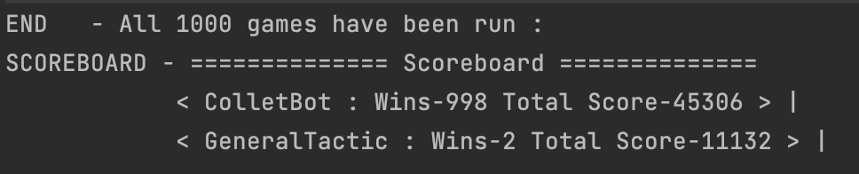

We do think that the strategy specified in the specs has been thought thoroughly projects after projects through the
years. Furthermore, this bot follows the rush panda strategy which is known to be extremely efficient.
In our case, the strategy is less efficient because the priority coefficients are not optimized.

TLDR : Rush panda strategy is overpowered...

---

## Architecture and Quality

### Overview

In this section, we will go over all the main components of our architecture. We will discuss how it works, how it used
and if its quality is good.
Here is the list of all the components :

- [GameEngine](#game-engine) -> responsible for managing the course of the game
- [Action](#action) -> something that the bot can do
- [Objective](#objective) -> represent an objective card
- [Bot](#bot) -> only contains the behavior
- [BotManager](#bot-manager) -> stores a bot with its inventory and attributes
- [Board](#board) -> contains all the elements that can be placed or used on the board
- [Layers](#layers) -> different types of layers to represent the tiles, the bamboos and the irrigation channels
- [Shape](#shape) -> represents a combination of tiles
- [Statistics](#statistics) -> used to measure and export what is happening during a game
- [Logging](#logging) -> used to display data in the console with different levels
- [Coordinate](#coordinate) -> represent the cube coordinates for a hexagonal grid

Even if we discuss the quality of each component, we will spend some time discussing the SonarQube report, the test
coverage and
what we think of the quality of the project in general. It is in this section : [Quality](#quality)

Regarding documentation, you can find
our [Javadoc](https://pns-si3-projects.github.io/projet2-ps5-22-23-takenoko-2023-c/apidocs/index.html)
as well as
our [PIT test report](https://pns-si3-projects.github.io/projet2-ps5-22-23-takenoko-2023-c/pit-reports/index.html)
hosted via GitHub Pages.
We also have the
whole [Maven documentation](https://pns-si3-projects.github.io/projet2-ps5-22-23-takenoko-2023-c/project-info.html)
generated.
The subject is discussed in the following section : [Documentation](#documentation)

### Architecture

For each category, we will focus how the system works in general. This means that we won't go in details about each
attribute
or method a class has. However, you should be able to understand how the project is tied up.

#### Game Engine

Our game engine follows a really simple procedure and has quite few responsibility.  
To run a game you just need to call the four following methods in order :

- `newGame()`
- `startGame()`
- `playGame()`
- `endGame()`

This execution process is already defined in the `runGame()` method. If you do not run the previous methods in order, it
will
raise an error explaining why it failed.

You can also run many games one after the other using the following method : `runGame(int)`.

You can specify the bot managers you want to use in your game by using one of the constructors.

   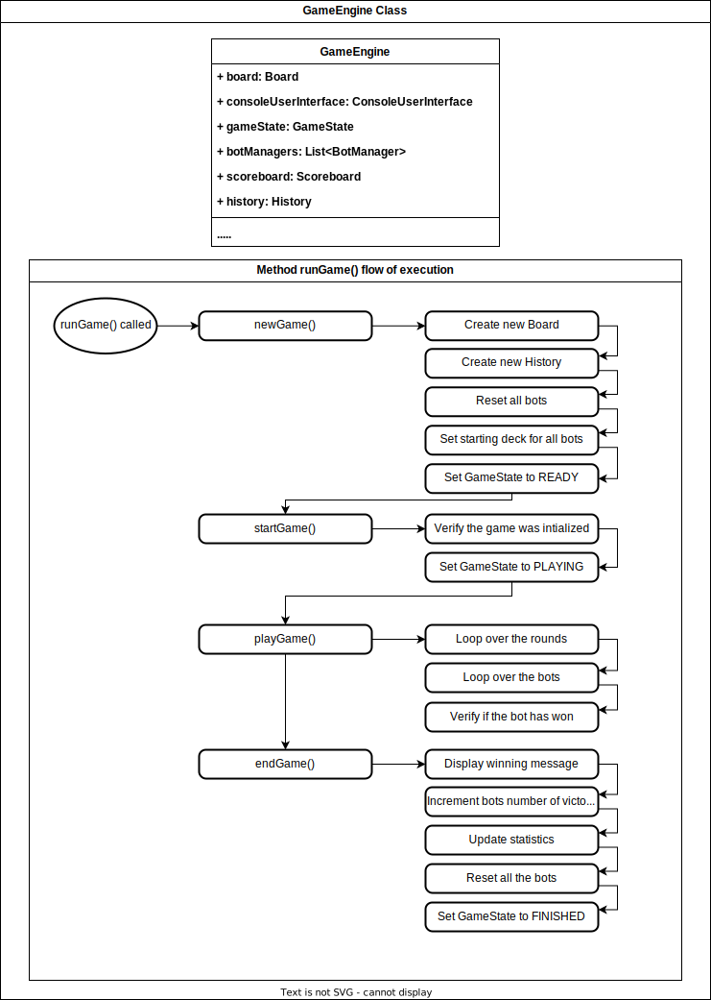

#### Action

    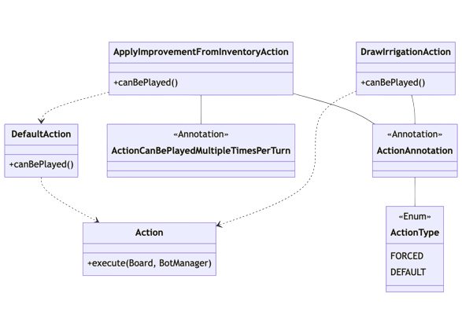

#### Objective

The `Objective` class represents an objective card from the game.
It can have one of the three available types. It also has a state to specify if it is achieved or not.

All of our objectives extend the `Objective` class.

Each objective has a different `verify(...)` method that can be called to know if the objective is achieved or not on
the
current setup of the board.
Each objective has a different `getCompletion(...)` in order to find out the highest percentage of completion for the
said
objective.

   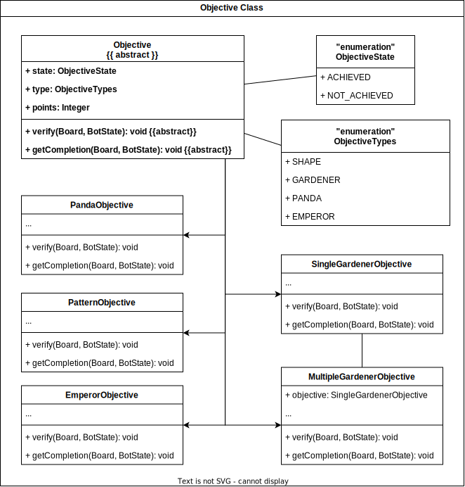

#### Bot

    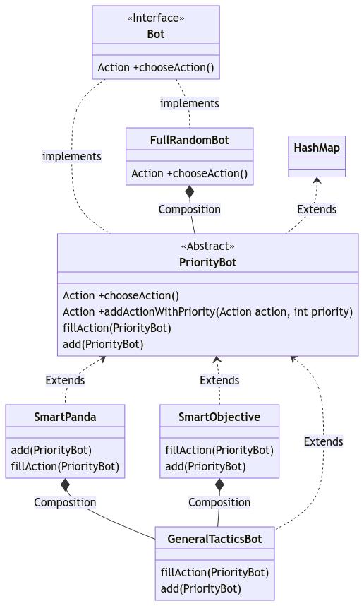

#### Bot Manager

As said in the name, the `Bot Manager` is responsible for managing a bot, its available actions, its inventory, its
objectives.
A `Bot` in itself just represent the behavior of the said bot (see [Bot](#bot)).

The main method of a bot manager is `playBot(...)`. This method is responsible for managing correctly how a bot turn
should go.  
This means that it will roll the weather dice and then tell the bot to choose to do.  
Then, in the limit of doable actions, the bot manager will just call the `chooseAction(...)` of the bot. The result
given
can then be executed and added to the history.  
The result of the execution is an `ActionResult` which can then be used to update the available actions of the bot. To
lear
more about the `ActionResult` see [Action](#action).

   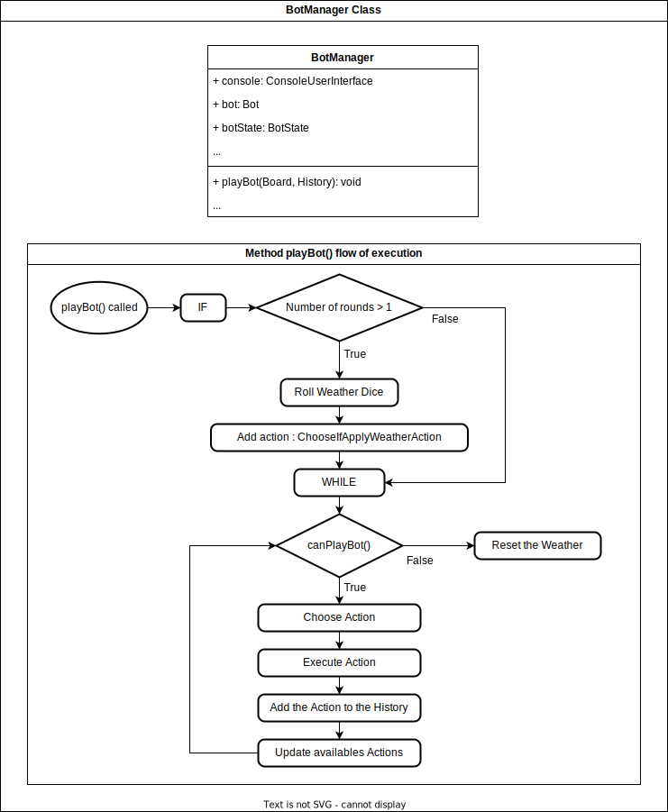

#### Board

The `Board` contains all the physical elements of a real game.  
The `Panda` and `Gardener` each have their own class that extends `Actor`. This class is responsible for managing the
movements.
The physical board is built from the tiles, the bamboos and the irrigation channels. To represent those we used layers,
so
our board has an attribute for each type of layer. To learn more see [Layers](#layers).
Since the weather is also general to the whole game, it belongs in `Board`.
Finally, we have a class `GameAssets` whose job is to store the weather dice, the improvement deck, the objective deck,
the tile deck and the irrigation deck. All of those are their own class.

Because the board contains so many elements, and that each of them is its own class, our `Board` is in fact only a
facade.
Having a facade is useful to avoid the anti-pattern named "Train Wreck Pattern".
Having a facade is also useful because the method called is independent of the method implemented below.

   

#### Layers

Our board is built using layers which are the following :

- Tile layer
- Bamboo layer
- Irrigation layer

Those layers are all `HashMap` that map a `PositionVector` to a `Tile` or a `BambooStack` or a boolean for the
irrigation channels telling whether it is irrigated.

Because all the HashMaps are part of the same board, we can access elements of each layer by using the position of it.

This separation of layers is useful because it allows us to have a more modular board. It is also easier to respect the
SRP (Single Responsibility Principle) this way. We can separate methods that belongs only to a certain layer.

#### Patterns

First of all we have the `Shape` class. It is used to define a shape of tiles using an HashMap of all the elements that
constitute the shape. Because the shape is defined by a HashMap, we can easily check if a tile is part of the shape or
not.  
The most important methods are the following ones : 
- `rotate60()` : that allows us to rotate the shape on the board around it center.
- `translate()` : that allows us to move the shape around the board.

We then have the `Pattern` class which extends from `Shape`. It is used to define the pattern that will be present on the objective cards. 
A pattern must contain the origin of the board. We then translate and rotate the shape to find it on the board.

The most important methods are the following ones :
- `match(Board)` :  return a list of all the shapes that match the pattern on the board.
- `getSubsetMatchPattern(Board)` : return a list of all the shapes that could match the pattern if complete but are indeed just part of it.
- `getShapesToCompletePatternObjective(Board)` : return a list of all the shapes that need to be filled in order to complete the pattern.

#### Statistics

The statistics calculated in the project concern 2 main components: Bots and the Board.

The bot related statistics are defined as SingleBotStatistics, this class is used to store general game oriented
information (number of wins and losses + total score) as well as calculate averages and make comparisons in order to
answer questions such as "How often does the bot choose to perform this action?" or "Which weather does the bot choose
to apply the most times?". SingleBotStatistics also stores counters for tile placing, irrigation placing, bamboo
collecting, bamboo growing, and objective redeeming. These last metrics come together to form a broad portrayal of the
bots' priorities which, once combined with the previously mentioned information, serves as a way of visualizing the
bots' strategy.

As for the board related statistics, their main objective is to offer a general idea of how the game played out in the
end and paint a picture of the boards final state.

### Quality

#### Good quality

#### Not so good quality

### Documentation

As said in the [Overview](#overview), you can
our [Javadoc](https://pns-si3-projects.github.io/projet2-ps5-22-23-takenoko-2023-c/apidocs/index.html)
as well as
our [PIT test report](https://pns-si3-projects.github.io/projet2-ps5-22-23-takenoko-2023-c/pit-reports/index.html)
hosted via GitHub Pages.
We also have the
whole [Maven documentation](https://pns-si3-projects.github.io/projet2-ps5-22-23-takenoko-2023-c/project-info.html)
generated.

The Javadoc could be more complete and the code is lacking quite some comments in certain areas of the code. We tried
our
best to comment what we were doing as it is as important as the file you are currently reading.

The PIT test report results are discussed in the [Quality](#quality) section.

---

## Process

### Roles and Involvement

Each one of us was responsible for keeping the project issues up to date. We were also responsible for assigning the
issues
and linking them to the correct milestone.  
This management allowed us to keep track of what we were doing and what we still had to do. It also allowed us to see
how
we were progressing and if we were getting less productive. You can quite clearly see the Christmas holiday on the
graph...

The first image represents the number of issues done by each person. Then the graph represents the evolution of the
number
of issues completed, sorted by assignee to the task.

   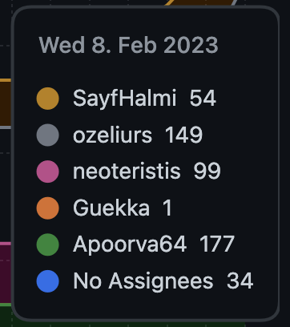

   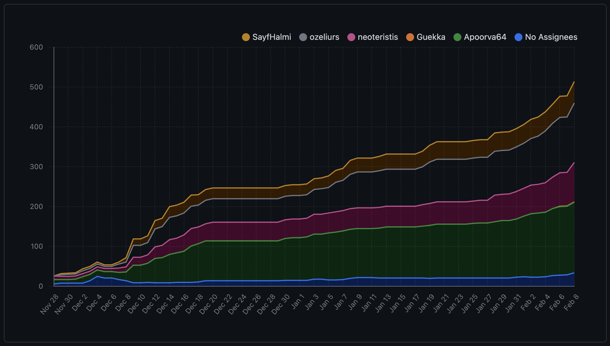

We were also all asked to review pull requests from other members of the team. We added rules to the GitHub branches on
the branches to make sure that the pull requests were reviewed by at least one other person before being merged for the
features.
Two people had to review the pull requests for the user-stories. And three people had to review the pull requests for
the
releases. You can more learn more about our branching strategy [there](#git-branching-strategy).

### Task Management

#### Agile Principles

We tried to follow the Agile principles for our task management throughout the whole project.
To do so, we decided to work with *Releases*, *User Stories* and *Features*.

*Releases* are meant to be **regular** and **must be stable**. They also must add value to the project. We did weekly
releases that were each containing about 3 *User stories*.

   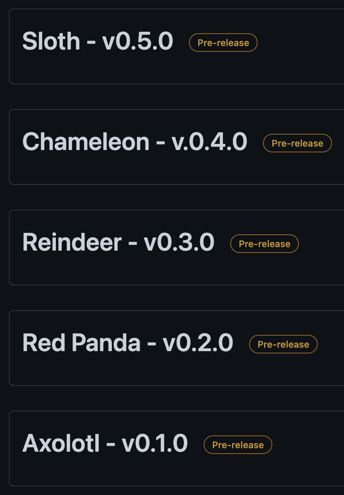

The *User Stories* are used to specify needs from the clients or developers.
We tried to follow this naming convention for most of our them :

- "As a dev, I can ... in order to ..."
- "As a bot, I can ... in order to ..."

   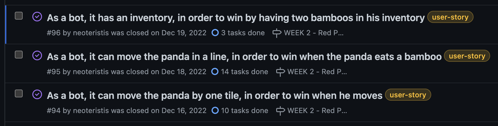

However, some have different names...

Concerning the *Features*, they are contained inside a *User Story*. Many *features* can be inside a single user story,
but a *feature* only belongs to one *user story*.
The *Features* are used to define a specific need to add to the project.

   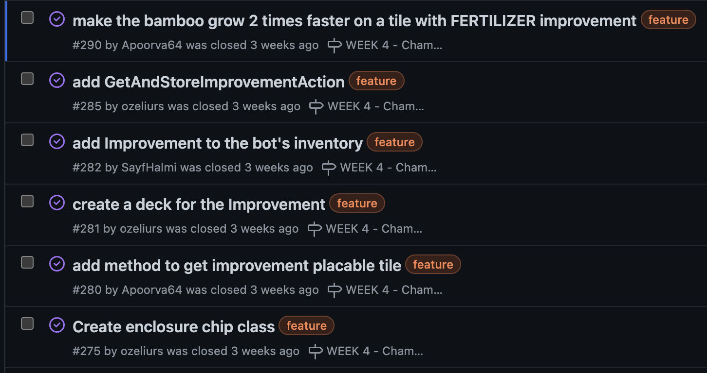

#### GitHub

##### Releases

We only used GitHub for our task management as we could do everything we wanted there.

The *Releases* were specified using *Milestones* from GitHub. As we were aiming to do one release per week, we also had
one milestone per week.
However, we fell behind some deadlines, especially during the Christmas holidays. This means that we have less releases
than weeks of work. However, they still follow this naming convention : "WEEK 00 - [ANIMAL NAME]". The week number was
increased by one each time we did a release.

   

Each time we did a release, we also created a package that could then be installed using Maven.
One version number is missing, because during the holiday we should have created package 0.3.0. But we did not, so later
we released 0.4.0 as 0.3.0. And then we decided to bump the version up to get back to the correct one.

   

   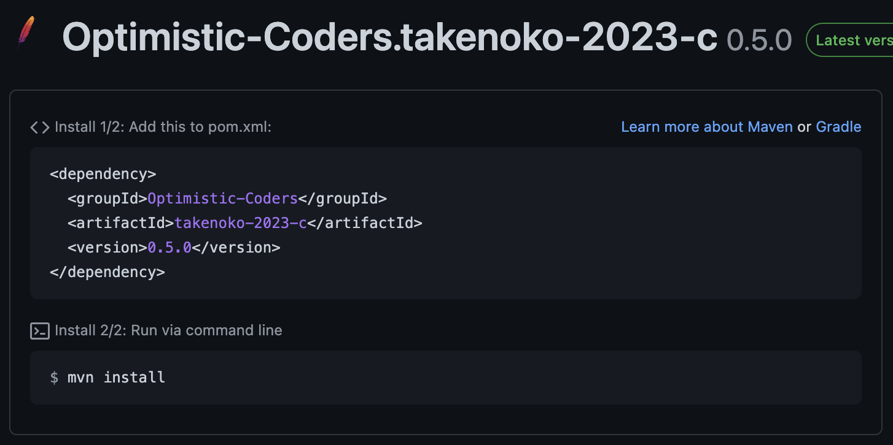

##### Tags

We used tags on all the issues to specify if it was a *User Story* or a *Feature*. The issues could also have different
tags like "docs", "test", "fix" or "hotfix".

##### GitHub Project

All of our issues where assigned to a GitHub Project. Since they were also correctly tagged, and we were opening and
closing them when needed, we had some statistics and graphs to look at.
We also tried to use the kanban provided but found out that, since issues were added gradually, we could just follow
their status in the list of issues.

You can find two of the interesting graphs below.

   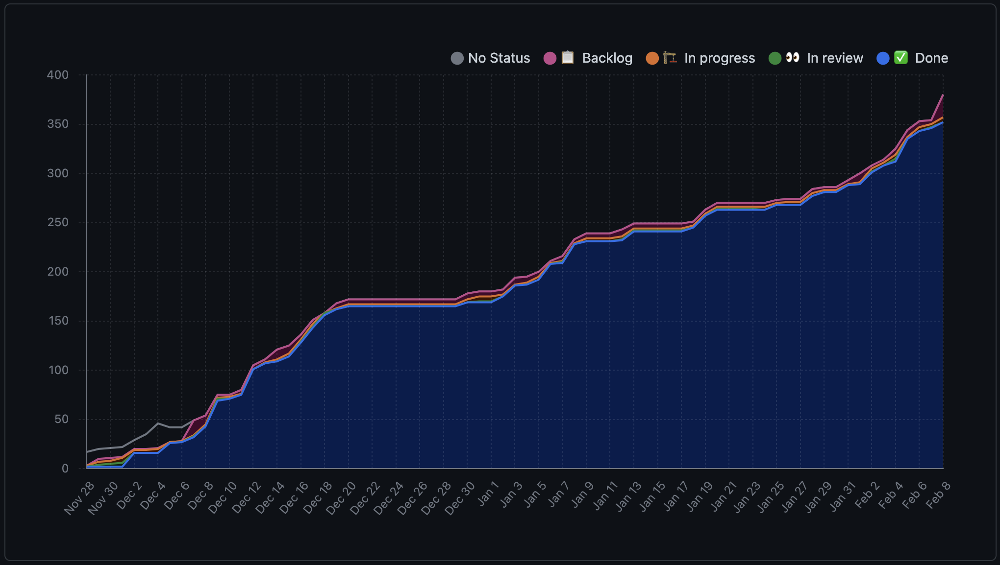

   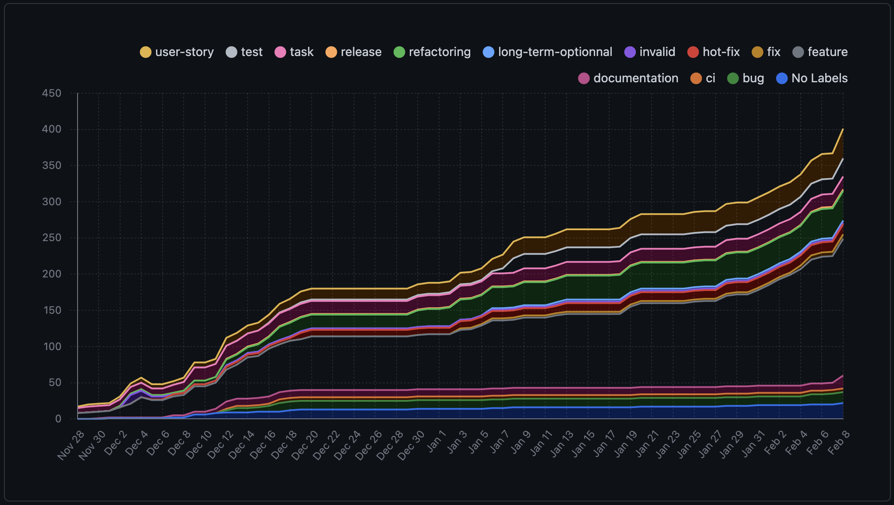

### Git Branching Strategy

Our strategy does not correspond to any other one that we could find online.
However, it is inspired by
the [Git Flow Strategy](https://www.atlassian.com/git/tutorials/comparing-workflows/gitflow-workflow). We modified it in
order to have branches corresponding to how our tasks were organized.
Those tasks were organized in order to correspond to our we are [managing our tasks](#Task-Management). This implies
that we have the following branch categories :

- `main` : contains the stable releases
- `develop` : contains the stable user stories
- `us-` : contains a user story currently being developed
- `feat-` : contains a feature currently being developed

You can find below a visual representation of our branching strategy.

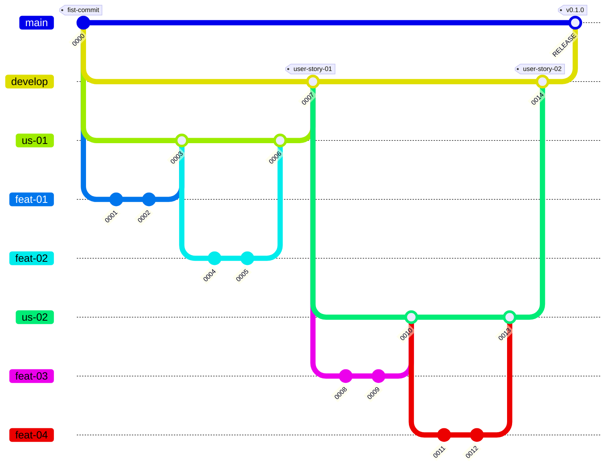

### Continuous Development and Automation

During the whole project, we tried to automate human prone errors as much as possible. We used different tools to do so.

#### Pre-commit Hooks

On each and every computer, we used a pre-commit hook to check our commit message convention, following
the [Conventional Commits](https://www.conventionalcommits.org/en/v1.0.0/) convention.

This allows us to categorize our commits by their type, additionally we can also specify a scope and a description.

#### Format check

We used the [Spotless](https://github.com/diffplug/spotless) both on our computers and on the GitHub actions CI to
respectively block commits and pull requests that do not follow
the [Google Java Style Guide](https://google.github.io/styleguide/javaguide.html).

#### Maven compiler

All of our builds are done using Maven. We used
the [Maven Compiler Plugin](https://maven.apache.org/plugins/maven-compiler-plugin/) to specify the version of Java we
wanted to use and first and foremost to have a unified version of Java on all of our computers.

#### Continuous integration with SonarQube

##### Jacoco

##### PIT test

#### Package
